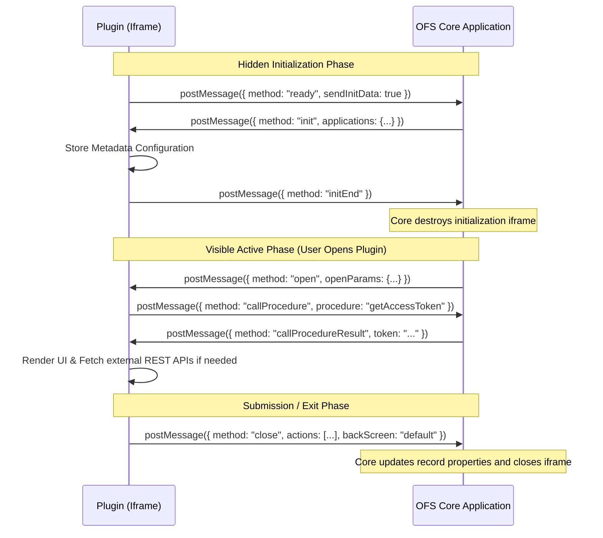

# Oracle Field Service (OFS) Plugin - Developer Reference Template

This repository contains a **minimal, lightweight, and secure boilerplate template** demonstrating the integration lifecycle of an **Oracle Field Service Cloud (OFSC) Plugin**. 

It is designed to serve as a clean reference architecture for developers who need to build custom plugins, forms, or applications that run inside an `iframe` within Oracle Field Service and communicate with the core application.

---

## ✨ Key Features

This template comes pre-configured with essential capabilities required for enterprise OFS plugins:

* **🎨 Oracle Redwood Styling:** Responsive interface matching Oracle's Redwood design palette (Terracotta, Slate Blue, Canvas Cream, and custom focus outlines) for a native extension appearance.
* **⚙️ Auto-Discovery & App Configuration:** Dynamically parses and discovers core application configurations and endpoint URLs (`resourceUrl`) from the host `init` payload.
* **🔑 Secure OAuth Token Retrieval:** Standard helper method wrapping the `callProcedure` ➡️ `getAccessToken` method to fetch authorization tokens from OFS.
* **📶 Online/Offline Connection State Management:** Native listeners track connection drops/restorations, displaying toast warnings and toggling network status badges.
* **💾 Local Form State Persistence:** Automatically saves form values locally in the background (offline support) and restores inputs if the page resets or the session expires.
* **📸 Native Code Scanner Integration:** Demonstrates device hardware integration by triggering the native device camera scanner via `callProcedure` ➡️ `scanBarcode`.

---

## 🏗️ Architecture & Communication Flow

Oracle Field Service plugins run in isolated contexts (iframes) and communicate with the host OFSC Core Application using the HTML5 cross-origin `window.postMessage()` API.

### **Lifecycle Message Flow**

1. **Auto-Discovery (`ready`):** 
   The plugin loads and immediately posts a `ready` message to the parent frame.
2. **Metadata Setup (`init` & `initEnd`):** 
   If `sendInitData` was set to `true`, OFSC Core replies with the `init` message (containing configuration properties, translation elements, and application endpoints). The plugin saves this and acknowledges with `initEnd`.
3. **Active State (`open`):** 
   When the user opens the plugin page, OFSC Core sends the `open` message containing contextual parameters (e.g. `aid` for Activity ID, `resourceId` for the technician's record). The plugin retrieves access tokens via `getAccessToken` and renders the UI.
4. **Synchronization (`close` or `update`):** 
   When the user completes their actions, the plugin sends a `close` message containing an `actions` array specifying what properties to update on the activity or inventory. The host applies the updates and closes the plugin iframe.



---

## 📂 File Structure

* **`index.html`**: Entry point for the plugin UI. Includes basic layout, action buttons, and loading spinner placeholder.
* **`style.css`**: Styling sheets including clean UI classes and a loader spinner aligned to the Oracle Redwood color themes.
* **`plugin.js`**: Core plugin controller. Manages:
  - Secure bidirectional message sending/receiving.
  - Verification of message origins.
  - Tracking synchronous procedure responses (`callProcedure`).
  - Form validation, auto-saving of offline state, and posting updates.
* **`localStorage.js`**: An abstraction layer for local storage to cache credentials, logs, and form states.

---

## ⚙️ How to Configure in Oracle Field Service

To test this plugin within your Oracle Field Service environment:

1. **Host the Files:**
   Upload the plugin folder to a secure, HTTPS-enabled web server or static website hosting provider (e.g., Oracle Cloud Infrastructure Object Storage, GitHub Pages, or AWS S3).
2. **Register the Plugin in OFS Console:**
   - Log into Oracle Field Service as an administrator.
   - Go to **Configuration** ➡️ **Plugins** ➡️ **Add Plugin**.
   - Fill in the details:
     * **Plugin Type:** `HTML5`
     * **URL:** `https://your-server-domain.com/plugin-directory/index.html`
     * **Security:** Configure secure parameters or applications if using OAuth.
3. **Map the Plugin to a Button/Action:**
   - Go to **Configuration** ➡️ **Screen Collaboration / Screen Steps**.
   - Select the target page layout (e.g. *Edit Activity* or *Activity Details*).
   - Add a button link and set the Action to launch your registered Plugin.

---

## 🛠️ Customization Checklist for Developers

Before deploying this template to production, you **MUST** customize the following areas:

### 1. Enforce Strict Origin Verification (Security)
In `plugin.js`, uncomment the origin validation return statement in `_messageListener` to ensure your plugin *only* accepts messages from your verified Oracle Cloud domain:
```javascript
// plugin.js
if (expectedOrigin && event.origin !== expectedOrigin) {
  console.warn(`[OFSC Security Warning] Ignored message from: ${event.origin}`);
  return; // <-- UNCOMMENT THIS IN PRODUCTION
}
```
In `_sendPostMessage`, replace the fallback wildcard `*` with your specific OFS cloud domain:
```javascript
// plugin.js
const origin = this._getOrigin(document.referrer) || "https://your-subdomain.fs.ocs.oraclecloud.com";
```

### 2. Map Form Fields to OFSC Properties
In the `SubmitBtn` click listener inside `plugin.js`, map your custom HTML form input IDs to standard or custom Oracle Field Service property keys. Note that OFSC custom property names are typically defined in **UPPERCASE** (e.g., `CUST_CONTACT_NAME`):
```javascript
// Map form input values to OFSC property keys
const propertiesToUpdate = {
  "CUSTOMER_PHONE": document.getElementById("phoneInput").value,
  "WORK_ORDER_NOTES": document.getElementById("notesTextArea").value,
};
```

### 3. Handle Cross-Origin Iframe Storage
Since this plugin runs in a cross-origin iframe, browser features like Safari's **Intelligent Tracking Prevention (ITP)** and Chrome's third-party cookie restrictions will block `localStorage` operations. 
- In production, implement a fallback strategy (such as checking if storage is available, using cookie fallback, or saving state in-memory) to handle cases where `localStorage.js` throws storage exceptions.

---

## 📸 Native Device Capabilities (Barcode Scanning)

This template includes a built-in demonstration of native hardware integration. 
- In [plugin.js](file:///Users/saikumargudelly/Downloads/OFSC_TEST_PLUGIN/plugin.js), the `scanBarcode` method uses OFSC's `callProcedure` to invoke the native mobile app's barcode reader:
  ```javascript
  const scanResult = await this.scanBarcode();
  ```
- Make sure to add `scanBarcode` to your plugin's **Allowed Procedures** in the OFS Administration screen.


---

## 💻 Local Testing & Simulation

Because OFSC plugins rely on the parent frame's `postMessage` protocol, they cannot run autonomously in a standalone tab.
To test locally:
1. Start a local server (e.g., using `npx serve` or Live Server in VS Code).
2. Create a mock wrapper page that frames the `index.html` plugin in an iframe and simulates the OFSC Core messages.
3. Verify that the console displays the outgoing lifecycle messages (`ready`, `initEnd`, `close`).

