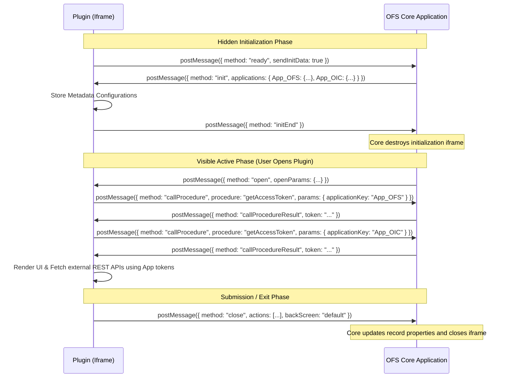

# Oracle Field Service (OFS) Plugin - Developer Reference Template

This repository contains a **minimal, lightweight, and secure boilerplate template** demonstrating the integration lifecycle of an **Oracle Field Service Cloud (OFSC) Plugin**. 

It is designed to serve as a clean reference architecture for developers who need to build custom plugins, forms, or applications that run inside an `iframe` within Oracle Field Service and communicate with the core application.

---

## ✨ Key Features

This template comes pre-configured with essential capabilities required for enterprise OFS plugins:

* **🎨 Oracle Redwood Styling:** Responsive interface matching Oracle's Redwood design palette (Terracotta, Slate Blue, Canvas Cream, and custom focus outlines) for a native extension appearance.
* **⚙️ Auto-Discovery & App Configuration:** Dynamically parses and discovers core application configurations and endpoint URLs (`resourceUrl`) from the host `init` payload.
* **🔑 Multi-App OAuth Token Caching:** Automatically discovers all configured host integrations (OFS, OIC, Oracle CX, SCM, ERP) and requests/caches their respective OAuth tokens in parallel on startup using `callProcedure` ➡️ `getAccessToken`.
* **📶 Online/Offline Connection State Management:** Native listeners track connection drops/restorations, displaying toast warnings and toggling network status badges.
* **💾 Local Form State Persistence:** Automatically saves form values locally in the background (offline support) and restores inputs if the page resets or the session expires.
* **📸 Native Code Scanner Integration:** Demonstrates device hardware integration by triggering the native device camera scanner via `callProcedure` ➡️ `scanBarcode`.

---

## 🏗️ Architecture & Communication Flow

Oracle Field Service plugins run in isolated contexts (iframes) and communicate with the host OFSC Core Application using the HTML5 cross-origin `window.postMessage()` API.

### **Lifecycle Message Flow**

1. **Auto-Discovery (`ready`):** 
   The plugin loads and immediately posts a `ready` message to the parent frame.
2. **Metadata Setup (`init` & `initEnd`):** 
   If `sendInitData` was set to `true`, OFSC Core replies with the `init` message (containing configuration properties, translation elements, and application endpoints). The plugin saves this and acknowledges with `initEnd`.
3. **Active State (`open`):** 
   When the user opens the plugin page, OFSC Core sends the `open` message containing contextual parameters (e.g. `aid` for Activity ID, `resourceId` for the technician's record). The plugin dynamically retrieves and caches OAuth access tokens in parallel for all configured applications (OFS, OIC, CX, SCM, ERP, etc.) via `getAccessToken` and renders the UI.
4. **Synchronization (`close` or `update`):** 
   When the user completes their actions, the plugin sends a `close` message containing an `actions` array specifying what properties to update on the activity or inventory. The host applies the updates and closes the plugin iframe.



---

## 📂 File Structure

* **`index.html`**: Entry point for the plugin UI. Includes basic layout, action buttons, and loading spinner placeholder.
* **`style.css`**: Styling sheets including clean UI classes and a loader spinner aligned to the Oracle Redwood color themes.
* **`plugin.js`**: Core plugin controller. Manages:
  - Secure bidirectional message sending/receiving.
  - Verification of message origins.
  - Tracking synchronous procedure responses (`callProcedure`).
  - Form validation, auto-saving of offline state, and posting updates.
* **`localStorage.js`**: An abstraction layer for local storage to cache credentials, logs, and form states.

---

## ⚙️ How to Configure in Oracle Field Service

To deploy and test this plugin within your Oracle Field Service (OFS) environment:

1. **Package the Plugin:**
   Create a standard `.zip` archive containing the plugin files. Ensure that `index.html` is in the root directory of the archive (not nested inside a subfolder).
2. **Upload to OFS Console:**
   - Log into Oracle Field Service as an administrator.
   - Go to **Configuration** ➡️ **Forms & Plugins**.
   - Click **Add Plugin** ➡️ select **Plugin Archive** ➡️ upload your ZIP file.
   - Set the following configuration parameters:
     * **Label:** `TEST_HELLO_OFSC` (this must match the bootstrap name in `plugin.js`).
     * **Secure Parameters:** Configure your OAuth Client/Application keys (OFS, OIC, CX, SCM, ERP) that the plugin will call.
     * **Allowed Procedures:** Enable **`scanBarcode`** (and any other native device operations your plugin calls).
3. **Map the Action Link (Button):**
   - Go to **Configuration** ➡️ **Action Links** (or **Screen Steps** layout editor).
   - Edit the target screen layout (e.g., *Activity Details* or *Edit Activity*).
   - Add a new button or link, set its action type to launch your newly uploaded plugin (`TEST_HELLO_OFSC`), and configure the visibility settings.

---

## 🛠️ Developer Customization Checklist

1. **Bootstrap Label:** Update the registration label at the bottom of `plugin.js` to match your registered OFS plugin label:
   ```javascript
   plugin.init("YOUR_OFS_PLUGIN_LABEL");
   ```
2. **OFS Property Mapping:** The template automatically loops through HTML inputs and maps their `id`s to uppercase OFS properties (e.g. input `#cust_phone` automatically maps to `CUST_PHONE`). Ensure your HTML `id`s match your target OFS custom properties.
3. **Cross-Origin Storage:** Since plugins run in iframes, browser security rules (like Safari ITP) may block `localStorage`. If needed, implement an in-memory or cookie fallback in `localStorage.js`.

---

## 📸 Native Device Capabilities (Barcode Scanning)

This template includes a built-in demonstration of native hardware integration. 
- In [plugin.js](file:///Users/saikumargudelly/Downloads/OFSC_TEST_PLUGIN/plugin.js), the `scanBarcode` method uses OFSC's `callProcedure` to invoke the native mobile app's barcode reader:
  ```javascript
  const scanResult = await this.scanBarcode();
  ```
- Make sure to add `scanBarcode` to your plugin's **Allowed Procedures** in the OFS Administration screen.


---

## 💻 Local Testing & Simulation

Because OFSC plugins rely on the parent frame's `postMessage` protocol, they cannot run autonomously in a standalone tab.
To test locally:
1. Start a local server (e.g., using `npx serve` or Live Server in VS Code).
2. Create a mock wrapper page that frames the `index.html` plugin in an iframe and simulates the OFSC Core messages.
3. Verify that the console displays the outgoing lifecycle messages (`ready`, `initEnd`, `close`).

